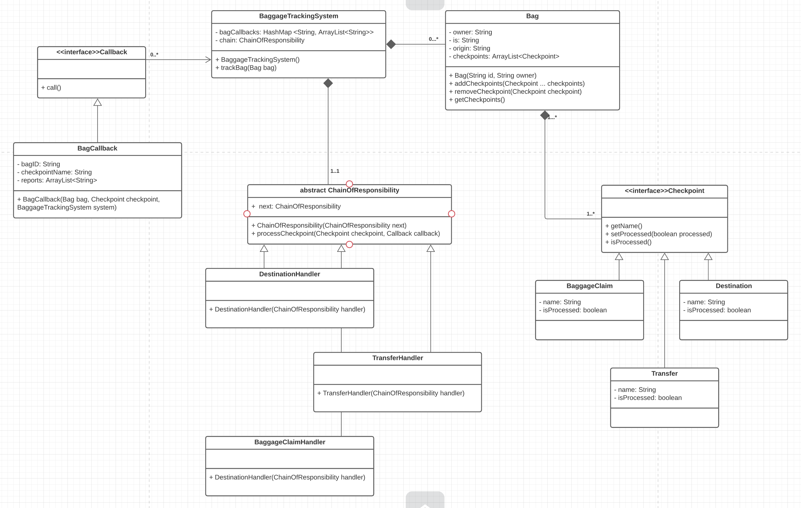

# Airport Baggage Handling System
CS 665 Spring 2021 </br>
By Iryna Chervachidze</br>

# Description of the Project
This is a project that demonstrates the use of two software design patterns, <b>Chain of Responsibility</b> and <b>Callback</b> in a simple application that simulates automatic handling of traveler's baggage.</br></br>

Consider a unified automated system that tracks and handles bags from their point of origination to the final destination. Each bag may have a number of checkpoints it needs to pass on the way to its final destination, and that number may not be the same for every bag. Sample checkpoints may include: loading/unloading to/from the plane, transfer to another terminal, and release to baggage claim. </br></br>

For example, we can have a bag that travels from Boston to Houston without any layovers. We can also have a bag that travels from Boston to Kiev (Ukraine) having multiple layovers. It is not known in advance how many such checkpoints are going to be included in the bag's journey.</br></br>

All these checkpoints are added to the bag's journey at runtime and depending on the checkpoint under consideration, the system needs to be able to handle bags. For instance, bag A can be unloaded from the airplane and released directly to the baggage claim. A bag B, on the other hand, needs to transfer to another terminal and then be loaded to the next plane.</br></br>

<b>Chain of Responsibility</b> design pattern seems to be able to fit this situation well. Depending on the checkpoint the bag is at, the chain will select exactly the right action (handling) for the bag. For example, for the bag A above, after unloading from the plane, the system will direct the bag to the baggage claim, as it is the next checkpoint for this particular bag. For the bag B above, the system will detect that the bag needs to move (transfer) to another terminal and then be loaded to another plane, and so forth, until the bag reaches its final destination.</br></br>

The second design pattern I used is <b>Callback</b> pattern. After passing a checkpoint, each bag sends a report (callback) back to the system on the last checkpoint that was successfully completed. This gives the system a trace of the bag's whereabouts.</br></br>

# Details of the implementation
Abstract class ChainOfResponstiblity serves as a parent class to three concrete implementations. The class contains a field of ChainOfResponstiblity type that serves as the next handler in the chain, if the current handler cannot handle the type of object that is passed to it. Each concrete implementation also overrides the processCheckpoint() method that provides specific handling for the given type of the Checkpoint object. For simplicity, I only included different printouts for different classes.</br></br>

As an example, consider bag A above. After unloading from the plane, the next checkpoint is baggage claims. My chain looks like the following:</br></br>

<code>chain = new DestinationHandler(new TransferHandler(new BaggageClaimHandler(null)))</code>

The system will first try to apply DestinationHandler to BaggageClaim object. Since it does not match the type of the object, it will then pass this object to the next handler in line, which is TransferHandler. Since it still cannot match the type, it  will again pass BaggageClaim object to BaggageClaimHandler, which will successfully handle it.</br></br>

My application only has three concrete implementations of the ChainOfResponstiblity abstract class, DestinationHandler, TransferHandler, and BaggageClaimHandler. It is very easy to extend the functionality of the system, in case we want to add another handler. For example, we want to add WaitInStorageHandler for those bags that need to be stored before they can be transfered to another terminal. Then, we will only need to add another concrete implementation of the ChainOfResponstiblity class called WaitInStorageHandler and add another concrete implementation of the Checkpoint interface, WaitInStorage. The client can add this checkpoint to the bag's checkpoints list at runtime and the system will take care of the rest.</br></br>

Callback pattern is implemented using a CallBack interface and a concrete class BagCallback. Every time the bag is handled by the system at checkpoints, I pass an object of BagCallback, which contains a single method call(): </br></br>

<pre>
@Override</br>
	public void call() {</br>
		reports.add(this.checkpointName);</br>
		logger.trace("<<callback of bag" + this.bagID + ": at " + this.checkpointName + ">>");</br>
	}
</pre>

Reference variable <b>reports</b> here points to the list of updates for the given bag that is stored by the system.

This method gets called after the bag is processed and in this way the system gets an update from the bag on the most recent checkpoint that was passed successfully. These updated are stored in a HashMap with the bag's identification numbers as keys. If the system needs a modification of the updates, we only need to change/modify one method, call() in BagCallback class. Nothing else needs to be changed.</br></br>

# UML Diagram


# How to compile the project

We use Apache Maven to compile and run this project. 

You need to install Apache Maven (https://maven.apache.org/)  on your system. 

Type on the command line: 

```bash
mvn clean compile
```

# How to create a binary runnable package 


```bash
mvn clean compile assembly:single
```


# How to run

```bash
mvn -q clean compile exec:java -Dexec.executable="edu.bu.met.cs665.Main" -Dlog4j.configuration="file:log4j.properties"
```

We recommand the above command for running the Main Java executable. 


# Run all the unit test classes.


```bash
mvn clean compile test checkstyle:check  spotbugs:check
```

# Using Spotbugs to find bugs in your project 

To see bug detail using the Findbugs GUI, use the following command "mvn findbugs:gui"

Or you can create a XML report by using  


```bash
mvn spotbugs:gui 
```

or 


```bash
mvn spotbugs:spotbugs
```


```bash
mvn spotbugs:check 
```

check goal runs analysis like spotbugs goal, and make the build failed if it found any bugs. 


For more info see 
https://spotbugs.readthedocs.io/en/latest/maven.html


SpotBugs https://spotbugs.github.io/ is the spiritual successor of FindBugs.


# Run Checkstyle 

CheckStyle code styling configuration files are in config/ directory. Maven checkstyle plugin is set to use google code style. 
You can change it to other styles like sun checkstyle. 

To analyze this example using CheckStyle run 

```bash
mvn checkstyle:check
```

This will generate a report in XML format


```bash
target/checkstyle-checker.xml
target/checkstyle-result.xml
```

and the following command will generate a report in HTML format that you can open it using a Web browser. 

```bash
mvn checkstyle:checkstyle
```

```bash
target/site/checkstyle.html
```


